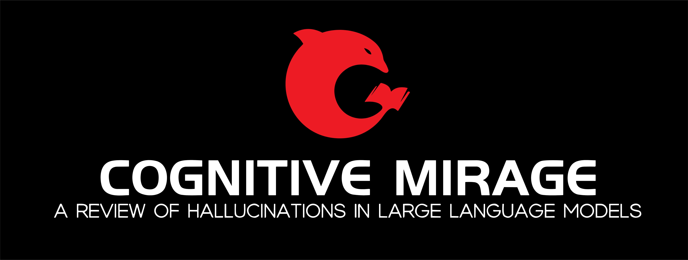

[//]: # (# Hallucination in Large Language Models: A Review)

     
      

    
   
    
    
 

Uncritical trust in LLMs can give rise to a phenomenon `Cognitive Mirage`, leading to misguided decision-making and a cascade of unintended consequences. 
To effectively control the risk of  `hallucinations`, we summarize recent progress in hallucination theories and solutions in this paper. We propose to organize relevant work by a comprehensive survey.

## 🏆 A Timeline of LLMs

| LLM Name                                                                                                                           | Title                          | Authors        | Publication Date |
|------------------------------------------------------------------------------------------------------------------------------------|--------------------------------|----------------|------------------|
| [T5](https://arxiv.org/abs/1910.10683)                                                                                             | Exploring the Limits of Transfer Learning with a Unified Text-to-Text Transformer. | Colin Raffel, Noam Shazeer, Adam Roberts | 2019.10          |
| [GPT-3](https://proceedings.neurips.cc/paper/2020/hash/1457c0d6bfcb4967418bfb8ac142f64a-Abstract.html)                             | Language Models are Few-Shot Learners. | Tom B. Brown, Benjamin Mann, Nick Ryder | 2020.12          |
| [mT5](https://doi.org/10.18653/v1/2021.naacl-main.41)                                                                              | mT5: A Massively Multilingual Pre-trained Text-to-Text Transformer. | Linting Xue, Noah Constant, Adam Roberts | 2021.3           |
| [Codex](https://arxiv.org/abs/2107.03374)                                                                                          | Evaluating Large Language Models Trained on Code. | Mark Chen, Jerry Tworek, Heewoo Jun | 2021.7           |
| [FLAN](https://openreview.net/forum?id=gEZrGCozdqR)                                                                                | Finetuned Language Models are Zero-Shot Learners. | Jason Wei, Maarten Bosma, Vincent Y. Zhao | 2021.9           |
| [WebGPT](https://arxiv.org/abs/2112.09332)                                                                                         | WebGPT: Browser-assisted question-answering with human feedback. | Reiichiro Nakano, Jacob Hilton, Suchir Balaji | 2021.12          |
| [InstructGPT](https://proceedings.neurips.cc//paper_files/paper/2022/hash/b1efde53be364a73914f58805a001731-Abstract-Conference.html) | Training language models to follow instructions with human feedback. | Long Ouyang, Jeffrey Wu, Xu Jiang | 2022.3           |
| [CodeGen](https://arxiv.org/abs/2203.13474)                                                                                        | CodeGen: An Open Large Language Model for Code with Multi-Turn Program Synthesis. | Erik Nijkamp, Bo Pang, Hiroaki Hayashi | 2022.3           |
| [Claude](https://arxiv.org/abs/2204.05862)                                                                                         | Training a Helpful and Harmless Assistant with Reinforcement Learning from Human Feedback. | Yuntao Bai, Andy Jones, Kamal Ndousse | 2022.4           |
| [PaLM](https://proceedings.neurips.cc//paper_files/paper/2022/hash/b1efde53be364a73914f58805a001731-Abstract-Conference.html)                                    | PaLM: Scaling Language Modeling with Pathways. | Aakanksha Chowdhery, Sharan Narang, Jacob Devlin | 2022.4        |
| [OPT](https://arxiv.org/abs/2205.01068)                                                                                           | OPT: Open Pre-trained Transformer Language Models. | Susan Zhang, Stephen Roller, Naman Goyal | 2022.5          |
| [Super-NaturalInstructions](https://doi.org/10.18653/v1/2022.emnlp-main.340)                                                                            | ESuper-NaturalInstructions: Generalization via Declarative Instructions on 1600+ NLP Tasks. | Yizhong Wang, Swaroop Mishra, Pegah Alipoormolabashi, Yeganeh Kordi | 2022.9          |
| [GLM](https://arxiv.org/abs/2210.02414)                                                                                            | GLM-130B: An Open Bilingual Pre-trained Model. | Aohan Zeng, Xiao Liu, Zhengxiao Du | 2022.10          |
| [BLOOM](https://doi.org/10.48550/arXiv.2211.05100)                                                                                      | BLOOM: A 176B-Parameter Open-Access Multilingual Language Model. | Teven Le Scao, Angela Fan, Christopher Akiki | 2022.11         |
| [LLaMA](https://arxiv.org/abs/2302.13971)                                                                                             | LLaMA: Open and Efficient Foundation Language Models. | Hugo Touvron, Thibaut Lavril, Gautier Izacard | 2023.2          |
| [Alpaca](https://crfm.stanford.edu/2023/03/13/alpaca.html)                                                                                     | Alpaca: A Strong, Replicable Instruction-Following Model. | Rohan Taori, Ishaan Gulrajani, Tianyi Zhang | 2023.3          |
| [GPT-4](https://arxiv.org/abs/2303.08774v2)                                                                                            | GPT-4 Technical Report. | OpenAI | 2023.3          |
| [WizardLM](https://doi.org/10.48550/arXiv.2304.12244)                                                                                         | WizardLM: Empowering Large Language Models to Follow Complex Instructions. | Can Xu, Qingfeng Sun, Kai Zheng | 2023.4          |
| [Vicuna](https://lmsys.org/blog/2023-03-30-vicuna/)                                                                                          | Vicuna: An Open-Source Chatbot Impressing GPT-4 with 90% ChatGPT Quality. | The Vicuna Team | 2023.5          |
| [ChatGLM](https://chatglm.cn/blog)                                                                                               | ChatGLM. | Wisdom and Clear Speech Team | 2023.6          |
| [Llama2](https://arxiv.org/abs/2307.09288)                                                                                             | Llama 2: Open Foundation and Fine-Tuned Chat Models. | Hugo Touvron, Louis Martin, Kevin Stone | 2023.7          |

   
## 🏳‍🌈 Definition of Hallucination

  - **"Survey of Hallucination in Natural Language Generation"**, 2022.2
    - Ziwei Ji, Nayeon Lee, Rita Frieske
    - [[Paper]](https://dblp.org/search?q=Survey%20of%20hallucination%20in%20natural%20language%20generation)

  - **"Do Language Models Know When They’re Hallucinating References?"**, 2023.5
    - Ayush Agrawal, Lester Mackey, Adam Tauman Kalai
    - [[Paper]](https://doi.org/10.48550/arXiv.2305.18248)

  - **"Truthful AI: Developing and governing AI that does not lie."**, 2021.10
    - Owain Evans, Owen Cotton-Barratt, Lukas Finnveden
    - [[Paper]](https://arxiv.org/abs/2110.06674)
    
  - **"Context-faithful Prompting for Large Language Models."**, 2023.11
    - Wenxuan Zhou, Sheng Zhang, Hoifung Poon
    - [[Paper]](https://arxiv.org/abs/2303.11315)

## 🎉 Mechanism Analysis

### ✨Data Attribution

  - **"Data Distributional Properties Drive Emergent In-Context Learning in Transformers."**, 2022.5 
    - Stephanie C. Y. Chan, Adam Santoro, Andrew K. Lampinen
    - [[Paper]](http://papers.nips.cc/paper_files/paper/2022/hash/77c6ccacfd9962e2307fc64680fc5ace-Abstract-Conference.html)
  
  - **"Hallucinations in Large Multilingual Translation Models."**, 2023.3
    - Nuno Miguel Guerreiro, Duarte M. Alves, Jonas Waldendorf
    - [[Paper]](https://doi.org/10.48550/arXiv.2303.16104)

  - **"Visual Instruction Tuning."**, 2023.4
    - Haotian Liu, Chunyuan Li, Qingyang Wu
    - [[Paper]](https://doi.org/10.48550/arXiv.2304.08485)
    
  - **"Evaluating Object Hallucination in Large Vision-Language Models."**, 2023.5
    - Yifan Li, Yifan Du, Kun Zhou
    - [[Paper]](https://arxiv.org/abs/2305.10355)

  - **"A Multitask, Multilingual, Multimodal Evaluation of ChatGPT on Reasoning, Hallucination, and Interactivity."**, 2023.2
    - Yejin Bang, Samuel Cahyawijaya, Nayeon Lee
    - [[Paper]](https://doi.org/10.48550/arXiv.2302.04023)
    
  - **"Sources of Hallucination by Large Language Models on Inference Tasks."**, 2023.5
    - Nick McKenna, Tianyi Li, Liang Cheng
    - [[Paper]](https://doi.org/10.48550/arXiv.2305.14552)
  
  - **"Towards Tracing Factual Knowledge in Language Models Back to the Training Data."**, 2022.5
    - Ekin Akyürek, Tolga Bolukbasi, Frederick Liu
    - [[Paper]](https://arxiv.org/abs/2205.11482)

  - **"Automatic Evaluation of Attribution by Large Language Models."**, 2023.5
    - Xiang Yue, Boshi Wang, Kai Zhang
    - [[Paper]](https://arxiv.org/abs/2305.06311)

### ✨Knowledge Gap

  - **"Zero-shot Faithful Factual Error Correction."**, 2023.5
    - Kung-Hsiang Huang, Hou Pong Chan, Heng Ji
    - [[Paper]](https://aclanthology.org/2023.acl-long.311)
  
  - **"Why Does ChatGPT Fall Short in Answering Questions Faithfully?"**, 2023.4
    - Shen Zheng, Jie Huang, Kevin Chen-Chuan Chang
    - [[Paper]](https://arxiv.org/abs/2304.10513)

  - **"Attributed Text Generation via Post-hoc Research and Revision."**, 2022.10
    - Luyu Gao, Zhuyun Dai, Panupong Pasupat
    - [[Paper]](https://doi.org/10.48550/arXiv.2210.08726)
    
  - **"Mitigating Language Model Hallucination with Interactive Question-Knowledge Alignment."**, 2023.5
    - Shuo Zhang, Liangming Pan, Junzhou Zhao
    - [[Paper]](https://arxiv.org/abs/2305.13669)

  - **"Evaluating Generative Models for Graph-to-Text Generation."**, 2023.7
    - huzhou Yuan, Michael Färber
    - [[Paper]](https://doi.org/10.48550/arXiv.2307.14712)

  - **"A Survey of Knowledge-enhanced Text Generation."**, 2022.1
    - Wenhao Yu, Chenguang Zhu, Zaitang Li
    - [[Paper]](https://doi.org/10.1145/3512467)
  
  - **"SelfCheckGPT: Zero-Resource Black-Box Hallucination Detection for Generative Large Language Models."**, 2023.3
    - Potsawee Manakul, Adian Liusie, Mark J. F. Gales
    - [[Paper]](https://doi.org/10.48550/arXiv.2303.08896)

  - **"Artificial Hallucinations in ChatGPT: Implications in Scientific Writing."**, 2023.2
    - Hussam Alkaissi, Samy I McFarlane
    - [[Paper]](https://www.ncbi.nlm.nih.gov/pmc/articles/PMC9939079/)
    
  - **"Adaptive Chameleon or Stubborn Sloth: Unraveling the Behavior of Large Language Models in Knowledge Clashes."**, 2023.5
    - Jian Xie, Kai Zhang, Jiangjie Chen
    - [[Paper]](https://arxiv.org/abs/2305.13300)

  - **"Overthinking the Truth: Understanding how Language Models Process False Demonstrations."**, 2023.7
    - Danny Halawi, Jean-Stanislas Denain, Jacob Steinhardt
    - [[Paper]](https://arxiv.org/abs/2307.09476)

   
### ✨Optimum Formulation

  - **"Improving Language Models via Plug-and-Play Retrieval Feedback."**, 2023.5
    - Wenhao Yu, Zhihan Zhang, Zhenwen Liang
    - [[Paper]](https://doi.org/10.48550/arXiv.2305.14002)
  
  - **"Improved Natural Language Generation via Loss Truncation."**, 2020.5
    - Daniel Kang, Tatsunori Hashimoto
    - [[Paper]](https://doi.org/10.18653/v1/2020.acl-main.66)

  - **"The Curious Case of Hallucinations in Neural Machine Translation."**, 2021.4
    - Vikas Raunak, Arul Menezes, Marcin Junczys-Dowmunt
    - [[Paper]](https://doi.org/10.18653/v1/2021.naacl-main.92)
    
  - **"Optimal Transport for Unsupervised Hallucination Detection in Neural Machine Translation."**, 2022.12
    - Nuno Miguel Guerreiro, Pierre Colombo, Pablo Piantanida
    - [[Paper]](https://doi.org/10.48550/arXiv.2212.09631)

  - **"Elastic Weight Removal for Faithful and Abstractive Dialogue Generation."**, 2023.3
    - Nico Daheim, Nouha Dziri, Mrinmaya Sachan
    - [[Paper]](https://doi.org/10.48550/arXiv.2303.17574)
    
  - **"HistAlign: Improving Context Dependency in Language Generation by Aligning with History."**, 2023.5
    - David Wan, Shiyue Zhang, Mohit Bansal
    - [[Paper]](https://doi.org/10.48550/arXiv.2305.04782)
  
  - **"How Language Model Hallucinations Can Snowball."**, 2023.5
    - Muru Zhang, Ofir Press, William Merrill
    - [[Paper]](https://doi.org/10.48550/arXiv.2305.13534)

## 🪁Taxonomy of LLMs Hallucination in NLP tasks
 
### ✨Machine  Translation
  - **"Unsupervised Cross-lingual Representation Learning at Scale."**, 2020.7
    - Alexis Conneau, Kartikay Khandelwal, Naman Goyal
    - [[Paper]](https://doi.org/10.18653/v1/2020.acl-main.747)

  - **"The Curious Case of Hallucinations in Neural Machine Translation."**, 2021.4
    - Vikas Raunak, Arul Menezes, Marcin Junczys-Dowmunt
    - [[Paper]](https://doi.org/10.18653/v1/2021.naacl-main.92)

  - **"Overcoming Catastrophic Forgetting in Zero-Shot Cross-Lingual Generation."**, 2022.5
    - Tu Vu, Aditya Barua, Brian Lester
    - [[Paper]](https://doi.org/10.18653/v1/2022.emnlp-main.630)
    
  - **"Looking for a Needle in a Haystack: A Comprehensive Study of Hallucinations in Neural Machine Translation."**, 2022.8
    - Nuno Miguel Guerreiro, Elena Voita, André F. T. Martins
    - [[Paper]](https://aclanthology.org/2023.eacl-main.75)

  - **"Prompting PaLM for Translation: Assessing Strategies and Performance."**, 2022.11
    - David Vilar, Markus Freitag, Colin Cherry
    - [[Paper]](https://arxiv.org/abs/2211.09102)

  - **"The unreasonable effectiveness of few-shot learning for machine translation."**, 2023.2
    - Xavier Garcia, Yamini Bansal, Colin Cherry
    - [[Paper]](https://arxiv.org/abs/2302.01398)
    
  - **"How Good Are GPT Models at Machine Translation? A Comprehensive Evaluation."**, 2023.2
    - Amr Hendy, Mohamed Abdelrehim, Amr Sharaf
    - [[Paper]](https://arxiv.org/abs/2302.09210)
    
  - **"Hallucinations in Large Multilingual Translation Models."**,  2023.3
    - Nuno Miguel Guerreiro, Duarte M. Alves, Jonas Waldendorf
    - [[Paper]](https://doi.org/10.48550/arXiv.2303.16104)
  
  - **"Investigating the Translation Performance of a Large Multilingual Language Model: the Case of BLOOM."**, 2023.3
    - Rachel Bawden, François Yvon
    - [[Paper]](https://arxiv.org/abs/2303.01911)

  - **"HalOmi: A Manually Annotated Benchmark for Multilingual Hallucination and Omission Detection in Machine Translation."**, 2023.5
    - David Dale, Elena Voita, Janice Lam, Prangthip Hansanti
    - [[Paper]](https://arxiv.org/abs/2305.11746)
   
  - **"mmT5: Modular Multilingual Pre-Training Solves Source Language Hallucinations."**, 2023.5
    - Jonas Pfeiffer, Francesco Piccinno, Massimo Nicosia
    - [[Paper]](https://doi.org/10.48550/arXiv.2305.14224)

### ✨Question and Answer

  - **"Hurdles to Progress in Long-form Question Answering."**, 2021.6
    - Kalpesh Krishna, Aurko Roy, Mohit Iyyer
    - [[Paper]](https://aclanthology.org/2021.naacl-main.393/)
  
  - **"Entity-Based Knowledge Conflicts in Question Answering."**, 2021.9
    - Shayne Longpre, Kartik Perisetla, Anthony Chen
    - [[Paper]](https://aclanthology.org/2021.emnlp-main.565/)

  - **"TruthfulQA: Measuring How Models Mimic Human Falsehoods."**, 2022.5
    - Stephanie Lin, Jacob Hilton, Owain Evans
    - [[Paper]](https://aclanthology.org/2022.acl-long.229)
    
  - **"Check Your Facts and Try Again: Improving Large Language Models with External Knowledge and Automated Feedback."**, 2023.2
    - Baolin Peng, Michel Galley, Pengcheng He
    - [[Paper]](https://arxiv.org/abs/2302.12813)

  - **"Why Does ChatGPT Fall Short in Answering Questions Faithfully?"**, 2023.4
    - Shen Zheng, Jie Huang, Kevin Chen-Chuan Chang
    - [[Paper]](https://doi.org/10.48550/arXiv.2304.10513)

  - **"Evaluating Correctness and Faithfulness of Instruction-Following Models for Question Answering."**,  2023.7
    - Vaibhav Adlakha, Parishad BehnamGhader, Xing Han Lu
    - [[Paper]](https://arxiv.org/abs/2307.16877)

  - **"Med-HALT: Medical Domain Hallucination Test for Large Language Models."**, 2023.7
    - Logesh Kumar Umapathi, Ankit Pal, Malaikannan Sankarasubbu
    - [[Paper]](https://arxiv.org/abs/2307.15343)

### ✨Dialog System

  - **"On the Origin of Hallucinations in Conversational Models: Is it the Datasets or the Models?"**, 2022.7
    - Nouha Dziri, Sivan Milton, Mo Yu
    - [[Paper]](https://aclanthology.org/2022.naacl-main.387/)

  - **"Contrastive Learning Reduces Hallucination in Conversations."**, 2022.12
    - Weiwei Sun, Zhengliang Shi, Shen Gao
    - [[Paper]](https://ojs.aaai.org/index.php/AAAI/article/view/26596)

  - **"Diving Deep into Modes of Fact Hallucinations in Dialogue Systems."**, 2022.12
    - Souvik Das, Sougata Saha, Rohini K. Srihari
    - [[Paper]](https://doi.org/10.18653/v1/2022.findings-emnlp.48)

  - **"Elastic Weight Removal for Faithful and Abstractive Dialogue Generation."**, 2023.3
    - Nico Daheim, Nouha Dziri, Mrinmaya Sachan
    - [[Paper]](https://doi.org/10.48550/arXiv.2303.17574)

### ✨Summarization System

  - **"Hallucinated but Factual! Inspecting the Factuality of Hallucinations in Abstractive Summarization."**, 2022.5
    - Meng Cao, Yue Dong, Jackie Chi Kit Cheung
    - [[Paper]](https://doi.org/10.18653/v1/2022.acl-long.236)
    
  - **"Evaluating the Factual Consistency of Large Language Models."**, 2022.11
    - Derek Tam, Anisha Mascarenhas, Shiyue Zhang
    - [[Paper]](https://doi.org/10.18653/v1/2023.findings-acl.322)
  
  - **"Why is this misleading?": Detecting News Headline Hallucinations with Explanations."**, 2023.2
    - Jiaming Shen, Jialu Liu, Dan Finnie
    - [[Paper]](https://doi.org/10.1145/3543507.3583375)

  - **"Detecting and Mitigating Hallucinations in Multilingual Summarisation."**, 2023.5
    - Yifu Qiu, Yftah Ziser, Anna Korhonen
    - [[Paper]](https://arxiv.org/abs/2305.13632)
    
  - **"LLMs as Factual Reasoners: Insights from Existing Benchmarks and Beyond."**, 2023.5
    - Philippe Laban, Wojciech Kryściński, Divyansh Agarwal
    - [[Paper]](https://arxiv.org/abs/2305.14540)

  - **"Evaluating Factual Consistency of Texts with Semantic Role Labeling."**, 2023.5
    - Jing Fan, Dennis Aumiller, Michael Gertz
    - [[Paper]](https://arxiv.org/abs/2305.13309)

###  ✨Knowledge Graphs with LLMs 

  - **"GPT-NER: Named Entity Recognition via Large Language Models."**, 2023.4
    - Shuhe Wang, Xiaofei Sun, Xiaoya Li
    - [[Paper]](https://arxiv.org/abs/2304.10428)

  - **"LLMs for Knowledge Graph Construction and Reasoning: Recent Capabilities and Future Opportunities."**, 2023.5
    - Yuqi Zhu, Xiaohan Wang, Jing Chen
    - [[Paper]](https://arxiv.org/abs/2305.13168)
    
  - **"KoLA: Carefully Benchmarking World Knowledge of Large Language Models."**, 2023.6
    - Jifan Yu, Xiaozhi Wang, Shangqing Tu
    - [[Paper]](https://arxiv.org/abs/2306.09296)

  - **"Evaluating Generative Models for Graph-to-Text Generation."**, 2023.7
    - Shuzhou Yuan, Michael Färber
    - [[Paper]](https://doi.org/10.48550/arXiv.2307.14712)

  - **"Text2KGBench: A Benchmark for Ontology-Driven Knowledge Graph Generation from Text."**, 2023.8
    - Nandana Mihindukulasooriya, Sanju Tiwari, Carlos F. Enguix
    - [[Paper]](https://arxiv.org/abs/2308.02357)

###  ✨Cross-modal System

  - **"Let there be a clock on the beach: Reducing Object Hallucination in Image Captioning."**, 2021.10
    - Ali Furkan Biten, Lluís Gómez, Dimosthenis Karatzas
    - [[Paper]](https://doi.org/10.1109/WACV51458.2022.00253)

  - **"Simple Token-Level Confidence Improves Caption Correctness."**, 2023.5
    - Suzanne Petryk, Spencer Whitehead, Joseph E. Gonzalez
    - [[Paper]](https://doi.org/10.48550/arXiv.2305.07021)

  - **"Evaluating Object Hallucination in Large Vision-Language Models."**, 2023.5
    - Yifan Li, Yifan Du, Kun Zhou, Jinpeng Wang
    - [[Paper]](https://arxiv.org/abs/2305.10355)
    
  - **"Album Storytelling with Iterative Story-aware Captioning and Large Language Models."**, 2023.5
    - Munan Ning, Yujia Xie, Dongdong Chen
    - [[Paper]](https://doi.org/10.48550/arXiv.2305.12943)

  - **"Fact-Checking of AI-Generated Reports."**, 2023.7
    - Razi Mahmood, Ge Wang, Mannudeep Kalra
    - [[Paper]](https://arxiv.org/abs/2307.14634)

### ✨Others
    
  - **"The Scope of ChatGPT in Software Engineering: A Thorough Investigation."**,  2023.5
    - Wei Ma, Shangqing Liu, Wenhan Wang
    - [[Paper]](https://arxiv.org/abs/2305.12138)

  - **"Generating Benchmarks for Factuality Evaluation of Language Models."**, 2023.7
    - Dor Muhlgay, Ori Ram, Inbal Magar
    - [[Paper]](https://arxiv.org/abs/2307.06908)

# 🔮 Hallucination Detection

### ✨Inference Classifier
  - **"Evaluating the Factual Consistency of Large Language Models Through Summarization."**,  2022.11
    - Derek Tam, Anisha Mascarenhas, Shiyue Zhang
    - [[Paper]](https://doi.org/10.18653/v1/2023.findings-acl.322)

  - **"Why is this misleading?": Detecting News Headline Hallucinations with Explanations."**, 2023.2
    - Jiaming Shen, Jialu Liu, Daniel Finnie
    - [[Paper]](https://doi.org/10.1145/3543507.3583375)

  - **"HaluEval: A Large-Scale Hallucination Evaluation Benchmark for Large Language Models."**,  2023.5
    - Junyi Li, Xiaoxue Cheng, Wayne Xin Zhao
    - [[Paper]](https://doi.org/10.48550/arXiv.2305.11747)

  - **"Fact-Checking of AI-Generated Reports."**, 2023.7
    - Razi Mahmood, Ge Wang, Mannudeep K. Kalra
    - [[Paper]](https://doi.org/10.48550/arXiv.2307.14634)

    

### ✨Uncertainty Measure

  - **"BARTScore: Evaluating Generated Text as Text Generation."**,  2021.6
    - Weizhe Yuan, Graham Neubig, Pengfei Liu
    - [[Paper]](https://proceedings.neurips.cc/paper/2021/hash/e4d2b6e6fdeca3e60e0f1a62fee3d9dd-Abstract.html)

  - **"Contrastive Learning Reduces Hallucination in Conversations."**, 2022.12
    - Weiwei Sun, Zhengliang Shi, Shen Gao
    - [[Paper]](https://ojs.aaai.org/index.php/AAAI/article/view/26596)
    
  - **"Knowledge of Knowledge: Exploring Known-Unknowns Uncertainty with Large Language Models."**, 2023.5
    - Alfonso Amayuelas, Liangming Pan, Wenhu Chen
    - [[Paper]](https://doi.org/10.48550/arXiv.2305.13712)

 - **"Methods for Measuring, Updating, and Visualizing Factual Beliefs in Language Models."**, 2023.5
    - Peter Hase, Mona Diab, Asli Celikyilmaz
    - [[Paper]](https://aclanthology.org/2023.eacl-main.199/)

  - **"Measuring and Modifying Factual Knowledge in Large Language Models."**, 2023.6
    - Pouya Pezeshkpour
    - [[Paper]](https://arxiv.org/abs/2306.06264)

  - **"LLM Calibration and Automatic Hallucination Detection via Pareto Optimal Self-supervision."**, 2023.6
    - Theodore Zhao, Mu Wei, J. Samuel Preston
    - [[Paper]](https://arxiv.org/abs/2306.16564)

  - **"A Stitch in Time Saves Nine: Detecting and Mitigating Hallucinations of LLMs by Validating Low-Confidence Generation."**, 2023.7
    - Neeraj Varshney, Wenlin Yao, Hongming Zhang
    - [[Paper]](https://arxiv.org/abs/2307.03987)

### ✨Self-Evaluation

  - **"Language Models (Mostly) Know What They Know."**, 2022.7
    - Saurav Kadavath, Tom Conerly, Amanda Askell
    - [[Paper]](https://doi.org/10.48550/arXiv.2207.05221)
    
  - **"SelfCheckGPT: Zero-Resource Black-Box Hallucination Detection for Generative Large Language Models."**, 2023.3
    - Potsawee Manakul, Adian Liusie, Mark J. F. Gales
    - [[Paper]](https://doi.org/10.48550/arXiv.2303.08896)

  - **"Do Language Models Know When They’re Hallucinating References?"**,  2023.5
    - Ayush Agrawal, Lester Mackey, Adam Tauman Kalai
    - [[Paper]](https://doi.org/10.48550/arXiv.2305.18248)

  - **"Evaluating Object Hallucination in Large Vision-Language Models."**, 2023.5
    - Yifan Li, Yifan Du, Kun Zhou, Jinpeng Wang
    - [[Paper]](https://doi.org/10.48550/arXiv.2305.10355)

  - **"Self-Checker: Plug-and-Play Modules for Fact-Checking with Large Language Models."**,  2023.5
    - Miaoran Li, Baolin Peng, Zhu Zhang
    - [[Paper]](https://arxiv.org/abs/2305.14623)
    
  - **"LM vs LM: Detecting Factual Errors via Cross Examination."**, 2023.5
    - Roi Cohen, May Hamri, Mor Geva
    - [[Paper]](https://arxiv.org/abs/2305.13281)

  - **"Self-contradictory Hallucinations of Large Language Models: Evaluation, Detection and Mitigation."**, 2023.5
    - Niels Mündler, Jingxuan He, Slobodan Jenko
    - [[Paper]](https://arxiv.org/abs/2305.15852)

### ✨Evidence Retrieval

  - **"FActScore: Fine-grained Atomic Evaluation of Factual Precision in Long Form Text Generation."**,  2023.5
    - Sewon Min, Kalpesh Krishna, Xinxi Lyu
    - [[Paper]](https://arxiv.org/abs/2305.14251)

  - **"Complex Claim Verification with Evidence Retrieved in the Wild."**, 2023.5
    - Jifan Chen, Grace Kim, Aniruddh Sriram
    - [[Paper]](https://doi.org/10.48550/arXiv.2305.11859)

  - **"Retrieving Supporting Evidence for LLMs Generated Answers."**,  2023.6
    - Siqing Huo, Negar Arabzadeh, Charles L. A. Clarke
    - [[Paper]](https://doi.org/10.48550/arXiv.2306.13781)
    
  - **"FacTool: Factuality Detection in Generative AI -- A Tool Augmented Framework for Multi-Task and Multi-Domain Scenarios."**, 2023.7
    - I-Chun Chern, Steffi Chern, Shiqi Chen
    - [[Paper]](https://arxiv.org/abs/2307.13528)

# 🪄 Hallucination Correction

### ✨Parameter Enhancement

  - **"Factuality Enhanced Language Models for Open-Ended Text Generation."**, 2022.6
    - Nayeon Lee, Wei Ping, Peng Xu
    - [[Paper]](http://papers.nips.cc/paper_files/paper/2022/hash/df438caa36714f69277daa92d608dd63-Abstract-Conference.html)

  - **"Contrastive Learning Reduces Hallucination in Conversations."**, 2022.12
    - Weiwei Sun, Zhengliang Shi, Shen Gao
    - [[Paper]](https://ojs.aaai.org/index.php/AAAI/article/view/26596)

  - **"Editing Models with Task Arithmetic."**,  2023.2
    - Gabriel Ilharco, Marco Tulio Ribeiro, Mitchell Wortsman
    - [[Paper]](https://openreview.net/forum?id=6t0Kwf8-jrj)

  - **"Elastic Weight Removal for Faithful and Abstractive Dialogue Generation."**, 2023.3
    - Nico Daheim, Nouha Dziri, Mrinmaya Sachan
    - [[Paper]](https://doi.org/10.48550/arXiv.2303.17574)

  - **"HISTALIGN: Improving Context Dependency in Language Generation by Aligning with History."**, 2023.5
    - David Wan, Shiyue Zhang, Mohit Bansal
    - [[Paper]](https://doi.org/10.48550/arXiv.2305.04782)
    
  - **"mmT5: Modular Multilingual Pre-Training Solves Source Language Hallucinations."**, 2023.5
    - Jonas Pfeiffer, Francesco Piccinno, Massimo Nicosia
    - [[Paper]](https://arxiv.org/abs/2305.14224)

  - **"Trusting Your Evidence: Hallucinate Less with Context-aware Decoding."**, 2023.5
    - Weijia Shi, Xiaochuang Han, Mike Lewis
    - [[Paper]](https://doi.org/10.48550/arXiv.2305.14739)

  - **"PURR: Efficiently Editing Language Model Hallucinations by Denoising Language Model Corruptions."**, 2023.5
    - Anthony Chen, Panupong Pasupat, Sameer Singh
    - [[Paper]](https://arxiv.org/abs/2305.14908)

  - **"Augmented Large Language Models with Parametric Knowledge Guiding."**, 2023.5
    - Ziyang Luo, Can Xu, Pu Zhao, Xiubo Geng
    - [[Paper]](https://arxiv.org/abs/2305.04757)

  - **"Inference-Time Intervention: Eliciting Truthful Answers from a Language Model."**, 2023.6
    - Kenneth Li, Oam Patel, Fernanda Viégas
    - [[Paper]](https://arxiv.org/abs/2306.03341)

  - **"TRAC: Trustworthy Retrieval Augmented Chatbot."**, 2023.7
    - Shuo Li, Sangdon Park, Insup Lee
    - [[Paper]](https://doi.org/10.48550/arXiv.2307.04642)
    
  - **"EasyEdit: An Easy-to-use Knowledge Editing Framework for Large Language Models"**, 2023.8
    - Peng Wang, Ningyu Zhang, Xin Xie
    - [[Paper]](https://arxiv.org/abs/2308.07269)

    
### ✨Post-hoc Attribution and Edit Technology

  - **"Neural Path Hunter: Reducing Hallucination in Dialogue Systems via Path Grounding."**, 2021.4
    - Nouha Dziri, Andrea Madotto, Osmar Zaïane
    - [[Paper]](https://doi.org/10.18653/v1/2021.emnlp-main.168)

  - **"Chain-of-Thought Prompting Elicits Reasoning in Large Language Models."**, 2022.1
    - Jason Wei, Xuezhi Wang, Dale Schuurmans, Maarten Bosma
    - [[Paper]](http://papers.nips.cc/paper_files/paper/2022/hash/9d5609613524ecf4f15af0f7b31abca4-Abstract-Conference.html)

  - **"Teaching language models to support answers with verified quotes."**, 2022.3
    - Jacob Menick, Maja Trebacz, Vladimir Mikulik
    - [[Paper]](https://doi.org/10.48550/arXiv.2203.11147)

  - **"ORCA: Interpreting Prompted Language Models via Locating Supporting Data Evidence in the Ocean of Pretraining Data."**, 2022.5
    - Xiaochuang Han, Yulia Tsvetkov
    - [[Paper]](https://doi.org/10.48550/arXiv.2205.12600)

  - **"Large Language Models are Zero-Shot Reasoners."**, 2022.5
    - Takeshi Kojima, Shixiang Shane Gu, Machel Reid
    - [[Paper]](http://papers.nips.cc/paper_files/paper/2022/hash/8bb0d291acd4acf06ef112099c16f326-Abstract-Conference.html)

  - **"Rethinking with Retrieval: Faithful Large Language Model Inference."**, 2023.1
    - Hangfeng He, Hongming Zhang, Dan Roth
    - [[Paper]](https://doi.org/10.48550/arXiv.2301.00303)

  - **"TRAK: Attributing Model Behavior at Scale."**, 2023.3
    - Sung Min Park, Kristian Georgiev, Andrew Ilyas
    - [[Paper]](https://proceedings.mlr.press/v202/park23c.html)
    
  - **"Data Portraits: Recording Foundation Model Training Data."**, 2023.3
    - Marc Marone, Benjamin Van Durme
    - [[Paper]](https://doi.org/10.48550/arXiv.2303.03919)

  - **"Self-Refine: Iterative Refinement with Self-Feedback."**, 2023.3
    - Aman Madaan, Niket Tandon, Prakhar Gupta
    - [[Paper]](https://doi.org/10.48550/arXiv.2303.17651)

  - **"Reflexion: an autonomous agent with dynamic memory and self-reflection."**,  2023.3
    - Noah Shinn, Beck Labash, Ashwin Gopinath
    - [[Paper]](https://doi.org/10.48550/arXiv.2303.11366)

  - **"According to ..." Prompting Language Models Improves Quoting from Pre-Training Data."**,  2023.5
    - Orion Weller, Marc Marone, Nathaniel Weir
    - [[Paper]](https://doi.org/10.48550/arXiv.2305.13252)

  - **"Verify-and-Edit: A Knowledge-Enhanced Chain-of-Thought Framework."**, 2023.5
    - Ruochen Zhao, Xingxuan Li, Shafiq Joty
    - [[Paper]](https://arxiv.org/abs/2305.03268)

### ✨Utilizing Programming Languages

  - **"PAL: Program-aided Language Models."**, 2022.11
    - Luyu Gao, Aman Madaan, Shuyan Zhou
    - [[Paper]](https://proceedings.mlr.press/v202/gao23f.html)

  - **"Program of Thoughts Prompting: Disentangling Computation from Reasoning for Numerical Reasoning Tasks."**,  2022.11
    - Wenhu Chen, Xueguang Ma, Xinyi Wang
    - [[Paper]](https://doi.org/10.48550/arXiv.2211.12588)
    
  - **"Teaching Algorithmic Reasoning via In-context Learning."**, 2022.11
    - Hattie Zhou, Azade Nova, Hugo Larochelle
    - [[Paper]](https://doi.org/10.48550/arXiv.2211.09066)

  - **"Solving Challenging Math Word Problems Using GPT-4 Code Interpreter with Code-based Self-Verification."**, 2023.8
    - Aojun Zhou, Ke Wang, Zimu Lu
    - [[Paper]](https://arxiv.org/abs/2308.07921)

### ✨Leverage External Knowledge

  - **"Improving Language Models by Retrieving from Trillions of Tokens."**, 2021.12
    - Sebastian Borgeaud, Arthur Mensch, Jordan Hoffmann
    - [[Paper]](https://proceedings.mlr.press/v162/borgeaud22a.html)

  - **"Interleaving Retrieval with Chain-of-Thought Reasoning for Knowledge-Intensive Multi-Step Questions.**,  2022.12 
    - Harsh Trivedi, Niranjan Balasubramanian, Tushar Khot
    - [[Paper]](https://doi.org/10.18653/v1/2023.acl-long.557)

  - **"When Not to Trust Language Models: Investigating Effectiveness of Parametric and Non-Parametric Memories."**,  2022.12
    - Alex Mallen, Akari Asai, Victor Zhong
    - [[Paper]](https://doi.org/10.18653/v1/2023.acl-long.546)

  - **"Check Your Facts and Try Again: Improving Large Language Models with External Knowledge and Automated Feedback."**, 2023.2
    - Baolin Peng, Michel Galley, Pengcheng He
    - [[Paper]](https://arxiv.org/abs/2302.12813)

  - **"In-Context Retrieval-Augmented Language Models."**, 2023.2
    - Ori Ram, Yoav Levine, Itay Dalmedigos
    - [[Paper]](https://doi.org/10.48550/arXiv.2302.00083)

  - **"cTBL: Augmenting Large Language Models for Conversational Tables."**, 2023.3
    - Anirudh S. Sundar, Larry Heck
    - [[Paper]](https://doi.org/10.48550/arXiv.2303.12024)

  - **"GeneGPT: Augmenting Large Language Models with Domain Tools for Improved Access to Biomedical Information."**, 2023.4
    - Qiao Jin, Yifan Yang, Qingyu Chen
    - [[Paper]](https://arxiv.org/abs/2304.09667)

  - **"Active Retrieval Augmented Generation."**,  2023.5
    - Zhengbao Jiang, Frank F. Xu, Luyu Gao
    - [[Paper]](https://doi.org/10.48550/arXiv.2305.06983)
    
  - **"Chain of Knowledge: A Framework for Grounding Large Language Models with Structured Knowledge Bases."**, 2023.5
    - Xingxuan Li, Ruochen Zhao, Yew Ken Chia
    - [[Paper]](https://doi.org/10.48550/arXiv.2305.13269)
    
  - **"Gorilla: Large Language Model Connected with Massive APIs."**, 2023.5
    - Shishir G. Patil, Tianjun Zhang, Xin Wang
    - [[Paper]](https://doi.org/10.48550/arXiv.2305.15334)

  - **"RETA-LLM: A Retrieval-Augmented Large Language Model Toolkit."**, 2023.6
    - Jiongnan Liu, Jiajie Jin, Zihan Wang
    - [[Paper]](https://doi.org/10.48550/arXiv.2306.05212)
    
  - **"User-Controlled Knowledge Fusion in Large Language Models: Balancing Creativity and Hallucination."**, 2023.7
    - SChen Zhang
    - [[Paper]](https://arxiv.org/abs/2307.16139)

  - **"KnowledGPT: Enhancing Large Language Models with Retrieval and Storage Access on Knowledge Bases."**, 2023.8
    - Xintao Wang, Qianwen Yang, Yongting Qiu
    - [[Paper]](https://doi.org/10.48550/arXiv.2308.11761)

### ✨Assessment Feedback

  - **"Learning to summarize with human feedback."**, 2020.12
    - Nisan Stiennon, Long Ouyang, Jeffrey Wu
    - [[Paper]](https://proceedings.neurips.cc/paper/2020/hash/1f89885d556929e98d3ef9b86448f951-Abstract.html)

  - **"BRIO: Bringing Order to Abstractive Summarization."**, 2022.3
    - Yixin Liu, Pengfei Liu, Dragomir R. Radev
    - [[Paper]](https://doi.org/10.18653/v1/2022.acl-long.207)

  - **"Language Models (Mostly) Know What They Know."**, 2022.7
    - Saurav Kadavath, Tom Conerly, Amanda Askell
    - [[Paper]](https://doi.org/10.48550/arXiv.2207.05221)

  - **"Check Your Facts and Try Again: Improving Large Language Models with External Knowledge and Automated Feedback."**, 2023.2 
    - Baolin Peng, Michel Galley, Pengcheng He
    - [[Paper]](https://doi.org/10.48550/arXiv.2302.12813)

  - **"Chain of Hindsight Aligns Language Models with Feedback."**,  2023.2
    - Hao Liu, Carmelo Sferrazza, Pieter Abbeel
    - [[Paper]](https://doi.org/10.48550/arXiv.2302.02676)

  - **"Zero-shot Faithful Factual Error Correction."**,  2023.5
    - Kung-Hsiang Huang, Hou Pong Chan, Heng Ji
    - [[Paper]](https://doi.org/10.18653/v1/2023.acl-long.311)
    
  - **"CRITIC: Large Language Models Can Self-Correct with Tool-Interactive Critiquing."**, 2023.5
    - Zhibin Gou, Zhihong Shao, Yeyun Gong
    - [[Paper]](https://doi.org/10.48550/arXiv.2305.11738)

  - **"Album Storytelling with Iterative Story-aware Captioning and Large Language Models."**, 2023.5
    - Munan Ning, Yujia Xie, Dongdong Chen
    - [[Paper]](https://doi.org/10.48550/arXiv.2305.12943)

  - **"How Language Model Hallucinations Can Snowball."**, 2023.5
    - Muru Zhang, Ofir Press, William Merrill
    - [[Paper]](https://doi.org/10.48550/arXiv.2305.13534)
    
  - **"Mitigating Language Model Hallucination with Interactive Question-Knowledge Alignment."**, 2023.5
    - Shuo Zhang, Liangming Pan, Junzhou Zhao
    - [[Paper]](https://doi.org/10.48550/arXiv.2305.13669)

  - **"Improving Language Models via Plug-and-Play Retrieval Feedback."**, 2023.5
    - Wenhao Yu, Zhihan Zhang, Zhenwen Liang
    - [[Paper]](https://doi.org/10.48550/arXiv.2305.14002)
    
  - **"PaD: Program-aided Distillation Specializes Large Models in Reasoning."**, 2023.5
    - Xuekai Zhu, Biqing Qi, Kaiyan Zhang
    - [[Paper]](https://doi.org/10.48550/arXiv.2305.13888)

  - **"Enabling Large Language Models to Generate Text with Citations."**, 2023.5
    - Tianyu Gao, Howard Yen, Jiatong Yu
    - [[Paper]](https://doi.org/10.48550/arXiv.2305.14627)

  - **"Do Language Models Know When They’re Hallucinating References?"**, 2023.5
    - Ayush Agrawal, Lester Mackey, Adam Tauman Kalai
    - [[Paper]](https://doi.org/10.48550/arXiv.2305.18248)
    
  - **"Improving Factuality of Abstractive Summarization via Contrastive Reward Learning."**,  2023.7
    - I-Chun Chern, Zhiruo Wang, Sanjan Das
    - [[Paper]](https://doi.org/10.48550/arXiv.2307.04507)

### ✨Mindset Society

  - **"Hallucinations in Large Multilingual Translation Models."**, 2023.3
    - Nuno Miguel Guerreiro, Duarte M. Alves, Jonas Waldendorf
    - [[Paper]](https://doi.org/10.48550/arXiv.2303.16104)

  - **"Improving Factuality and Reasoning in Language Models through Multiagent Debate."**, 2023.5
    - Yilun Du, Shuang Li, Antonio Torralba
    - [[Paper]](https://doi.org/10.48550/arXiv.2305.14325)

  - **"Encouraging Divergent Thinking in Large Language Models through Multi-Agent Debate."**, 2023.5
    - Tian Liang, Zhiwei He, Wenxiang Jiao
    - [[Paper]](https://doi.org/10.48550/arXiv.2305.19118)

  - **"Examining the Inter-Consistency of Large Language Models: An In-depth Analysis via Debate."**, 2023.5
    -  Kai Xiong, Xiao Ding, Yixin Cao
    - [[Paper]](https://doi.org/10.48550/arXiv.2305.11595)
    
  - **"LM vs LM: Detecting Factual Errors via Cross Examination."**, 2023.5
    - Roi Cohen, May Hamri, Mor Geva
    - [[Paper]](https://arxiv.org/abs/2305.13281)

  - **"PRD: Peer Rank and Discussion Improve Large Language Model based Evaluations."**, 2023.7
    - Ruosen Li, Teerth Patel, Xinya Du
    - [[Paper]](https://doi.org/10.48550/arXiv.2307.02762)
    
  - **"Unleashing Cognitive Synergy in Large Language Models: A Task-Solving Agent through Multi-Persona Self-Collaboration."**, 2023.7
    - Zhenhailong Wang, Shaoguang Mao, Wenshan Wu
    - [[Paper]](https://doi.org/10.48550/arXiv.2307.05300)

## 🌟 TIPS
If you find this repository useful to your research or work, it is really appreciate to star this repository. 

